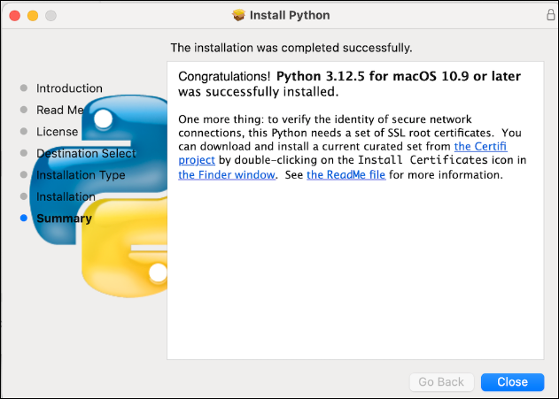

# 🟢 03-mac-install-python-git-vscode.md

This page provides instructions to install or verify **Python**, **Git**, and **Visual Studio Code** on a Mac using **official installers**.  
These tools are essential for professional data analytics.

## 1. Use Official Installers (Recommended for Most Users)

Download and Install Each Tool:

- **Python**: <https://www.python.org/>. Run the downloaded `.pkg` file and follow the installer instructions.
  - IMPORTANT: Finalize your installation by installing certificates. An additional step is shown when installation completes (see the screenshot below). Look for the Python installation in Finder. Find the "Install Certificates" icon, and double-click to run it. This will be required when we add Git - do this now, while the links are available.
- **Git** is often already installed on macOS. You can check by typing `git --version` in the terminal. If it's missing or outdated, install it from: <https://git-scm.com/>.
- **VS Code** (Visual Studio Code): <https://code.visualstudio.com/>. Run the downloaded file, extracting it first if needed.
  - Move the VS Code app into the Applications directory, to make it available via Launchpad.
  - Recommended: Follow the instructions at <https://code.visualstudio.com/docs/setup/mac> to "Launch VS Code from the command line". 

## 2. Restart Computer After Installation

Restart your computer after installation (optional but recommended).

## 3. Verify

After restarting, open a new Terminal and run the following commands to verify. 

```zsh
python3 --version
pip3 --version
git --version
```

IMPORTANT: Each command should return a version number.
If any fail, revisit the installers and try again.

---

## OPTIONAL/ADVANCED: Use Package Managers (Homebrew)

We can use package managers to install VS Code. Additional configuration may be need for these options. 
To try them, open a terminal and run the following commands:

```zsh
brew update
brew install python
brew install git
brew install --cask visual-studio-code
brew install pyenv
brew install --cask powershell

pyenv --version
pwsh --version
```

Note: The `--cask` option is used for GUI applications like Visual Studio Code and PowerShell. 
These apps will appear in Finder, Dock, and Spotlight search, just like other macOS applications.

Restart your machine and verify the installations using the same commands listed above.

---


## OPTIONAL/ADVANCED: Install Multiple Versions of Python with pyenv

If you need to add an earlier version of Python (e.g. to use with complex tools such as Kafka or Spark), use pyenv to install additional Python versions like so:

```zsh
pyenv install 3.11.11
```
---

## Screenshots



---

[🟢 Back to Part 1 Home](https://denisecase.github.io/pro-analytics-01/01-machine-setup/MACHINE-SETUP.html) | [🔗 View Part 1 on GitHub](https://github.com/denisecase/pro-analytics-01/01-machine-setup/MACHINE-SETUP.md)
