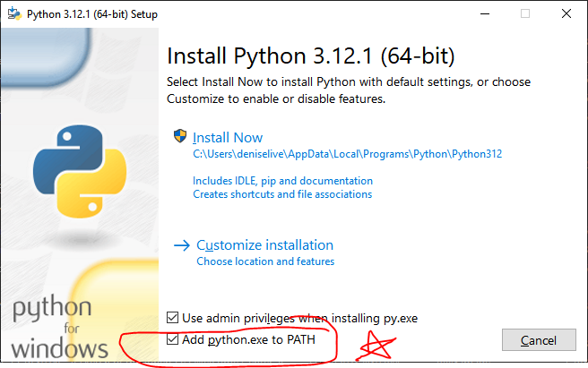

# 03-windows-install-python-git-vscode.md

This page provides instructions to install or verify **Python**, **Git**, and **Visual Studio Code** on a Windows machine using **official installers**.  
These tools are essential for professional data analytics.

## 1. Use Official Installers (Recommended for Most Users)

Download and Install Each Tool:

- **Python**: <https://www.python.org/> YOU MUST check **“Add Python to PATH”** during installation. If you forget, rerun installation with the box checked.
- **Git**: <https://git-scm.com/>
- **VS Code** (Visual Studio Code): <https://code.visualstudio.com/>

## 2. Restart Computer After Installation

Restart your computer after installation (optional but recommended).

## 3. Verify

After restarting, open a new PowerShell terminal and run the following commands to verify. 

```powershell
py --version
pip --version
git --version
code --version
```

IMPORTANT: Each command should return a version number.
If any fail, revisit the installers and try again. 

## OPTIONAL/ADVANCED: Installing Multiple Versions of Python

This is not typically needed. 
Only continue with this section if you need to add an earlier version of Python (e.g. to use with complex tools such as Kafka or Spark).

In that case, we can install additional Python versions like so:

```powershell
winget install --id Python.Python.3.11.11
```

Note: py --version and python --version and python3 --version may or may not work and may return different versions depending on which order they were installed, system path settings, and more. 
We can specify the desired Python version when creating a project virtual environment in the next workflow.

## OPTIONAL/ADVANCED: Use Package Managers (instructions may not be complete)

Open a PowerShell terminal and run the following commands:

```powershell
winget install --id Python.Python.3
winget install --id Git.Git
winget install --id Microsoft.VisualStudioCode
```
Restart your machine and verify as shown above. 

---

## Important

Your version will likely be newer, but remember to check the box to add Python to your path during installation.


---
